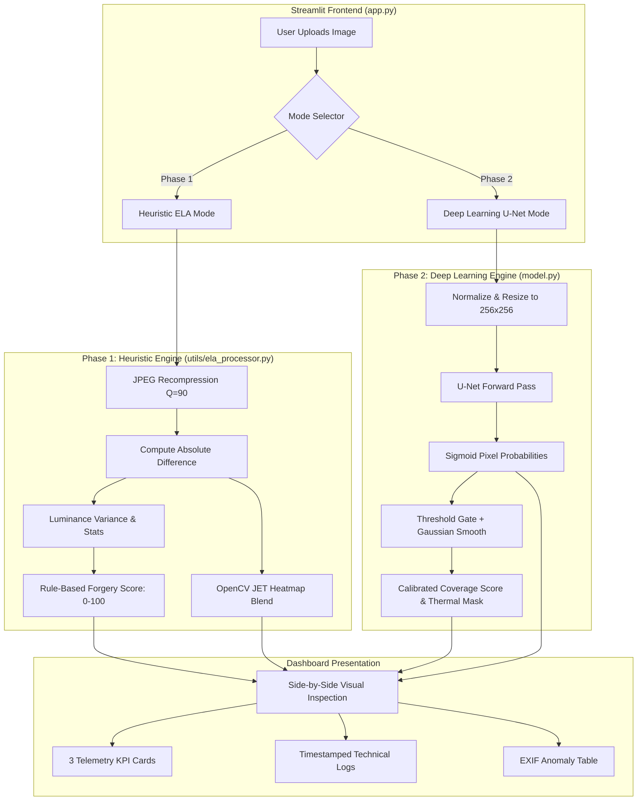

# 🔬 Image Forgery Detection System: Splicing & Tamper Detector

[](https://www.python.org/)
[](https://pytorch.org/)
[](https://streamlit.io/)
[](https://opencv.org/)
[](LICENSE)

An academic and production-ready digital image tamper and forgery detection suite implementing a **hybrid two-phase framework**:
1. **Phase 1 — Heuristic Error Level Analysis (ELA)**: Compression anomaly detection and statistical DCT residual scoring.
2. **Phase 2 — Deep Learning U-Net Segmentation**: End-to-end convolutional neural network producing pixel-precise tamper masks and thermal overlays trained on **CASIA v1/v2** benchmark protocols.

---

## 📌 Table of Contents
- [Project Overview](#-project-overview)
- [System Architecture](#-system-architecture)
- [Key Features](#-key-features)
- [How the System Works (Step-by-Step)](#-how-the-system-works-step-by-step)
- [How the Model Works (Deep Dive)](#-how-the-model-works-deep-dive)
- [Project Structure](#-project-structure)
- [Theoretical & Forgery Detection Methodology](#-theoretical--forgery-detection-methodology)
- [Dataset Preparation (CASIA Protocol)](#-dataset-preparation-casia-protocol)
- [Installation & Local Setup](#-installation--local-setup)
- [Usage Guide](#-usage-guide)
  - [1. Launching the Web Dashboard](#1-launching-the-web-dashboard)
  - [2. Training the U-Net Model](#2-training-the-u-net-model)
  - [3. Running Automated Verification](#3-running-automated-verification)
- [Benchmark Results](#-benchmark-results)
- [Security & Hardening Measures](#-security--hardening-measures)
- [Viva Questions & Answers](#-viva-questions--answers)
- [Academic References](#-academic-references)

---

## 🎯 Project Overview

Digital image splicing—copying a region from a donor image and pasting it onto a host image—introduces subtle boundary discrepancies, quantization mismatches, and noise inconsistencies. 

This project provides a complete, runnable solution comprising:
* **Interactive Forgery Detection Dashboard**: Built on Streamlit with a high-contrast modern laboratory UI (`#101319` canvas, `#00FFFF` cyan accents, `#FF4B4B` danger alerts).
* **Dual Detection Modes**: Real-time switching between fast ELA heuristics and deep-learning U-Net segmentation.
* **Pixel-Level Heatmap Blending**: OpenCV `COLORMAP_JET` thermal overlays highlighting exact tamper coordinates.
* **Full Training Pipeline**: Standalone PyTorch dataset loaders, `CombinedBCEDiceLoss`, and training loop.

---

## 🏗 System Architecture



---

## ✨ Key Features

* **Side-by-Side Comparative Workbench**: Displays original source image directly beside the generated heatmap overlay.
* **Dual-Engine Detection**:
  * **ELA Engine**: Rapid, calibration-free tamper analysis based on differential compression residuals.
  * **U-Net Engine**: Multi-scale feature extraction with skip connections to localize semantic and textural manipulation boundaries.
* **Modern Precision Theme**: Designed following clinical laboratory ergonomics (Inter font for UI, JetBrains Mono for telemetry).
* **Robust EXIF Parser**: Inspects camera models, capture timestamps, and detects metadata markers from editing suites (Photoshop, GIMP, Lightroom, Canva).
* **Hardened Security**: Protected against arbitrary code execution via PyTorch deserialization (`weights_only=True`), HTML injection (XSS sanitization), and memory exhaustion guards.

---

## ⚙️ How the System Works (Step-by-Step)

This section describes the complete end-to-end flow when a user uploads an image and clicks **Run Deep Scan**.

### Step 1 — Image Ingestion & Validation
```
User uploads image → Streamlit widget → PIL.Image loaded → dimension check
```
* The uploaded file (JPG/PNG/WEBP) is read into a `PIL.Image` object.
* A dimension guard thumbnail-downsamples any image exceeding 4096px to prevent RAM exhaustion (Decompression Bomb defense).
* The image is displayed in the **Source Image** panel on the left.

### Step 2 — EXIF Metadata Extraction (`utils/metadata.py`)
```
PIL.Image → EXIF tags → parse camera, software, GPS, timestamps
```
* Pillow's `_getexif()` reads all embedded EXIF tags.
* The system flags known editing-software markers (Photoshop, GIMP, Lightroom, Canva, CorelDRAW).
* Missing timestamps, mismatched camera models, and absent GPS data are noted as tampering soft-indicators.
* Results render in the **Metadata Anomaly Table** below the visual panels.

### Step 3A — Phase 1: ELA Heuristic Analysis (`utils/ela_processor.py`)
```
RGB Image → JPEG buffer @ Q=90 → |Original − Recompressed| × amplify → Stats → Score
```
1. The image is re-saved to an in-memory JPEG buffer at quality `Q=90`.
2. The pixel-wise absolute difference between the original and recompressed versions is computed.
3. Differences are amplified by factor `α=20` so subtle artifacts become visible.
4. Statistical metrics are extracted: `mean`, `variance`, `P99`, `high_pct`.
5. A weighted scoring formula combines these into a **0–100 Forgery Score**:

   | Component | Weight | Meaning |
   |---|---|---|
   | Variance | 60% | Uneven error distribution across blocks |
   | P99 spike | 20% | Extreme local anomaly |
   | High-diff % | 20% | Fraction of pixels with significant error |

6. The ELA difference map is passed through OpenCV's `COLORMAP_JET` and blended over the original at 45% opacity.

### Step 3B — Phase 2: Deep Learning U-Net Inference (`model.py`)
```
PIL RGB → Normalize (ImageNet stats) → Resize 256×256 → U-Net → Sigmoid → Probability Map
```
1. The image is pre-processed with ImageNet normalization and resized to 256×256.
2. A single forward pass through the 7.7M-parameter U-Net produces a `(1,1,256,256)` logit tensor.
3. Sigmoid activation converts logits to pixel-level tamper probabilities `[0.0, 1.0]`.
4. The probability map is bilinearly upsampled back to the original image dimensions.
5. **Calibrated scoring** is applied:
   - Only pixels above a `0.55` confidence threshold are considered.
   - At least `0.5%` of all pixels must exceed this threshold (rejects isolated noise spikes).
   - Final score = `mean(confident_pixels) × (0.6 + 0.4 × coverage_weight)`.
6. **Mask enhancement** runs `enhance_unet_mask()`:
   - Threshold gate zeros all sub-threshold pixels.
   - Large Gaussian blur merges adjacent anomaly pixels into solid blobs.
   - Morphological closing fills holes inside detected regions.
   - Min-max stretch applies full JET colormap dynamic range.

### Step 4 — Heatmap Overlay & Verdict Rendering
```
Enhanced mask → COLORMAP_JET → cv2.addWeighted(original, 1-α, heatmap, α) → Display
```
* Verdict thresholds: **Authentic** (0–35), **Suspicious** (36–65), **Spliced** (66–100).
* Three KPI cards display: Global Forgery Score, ELA Peak Luminance, U-Net Confidence.
* A timestamped technical log terminal shows every processing step in real time.

---

## 🧠 How the Model Works (Deep Dive)

### U-Net Architecture Overview

The U-Net (`model.py`) is a fully convolutional encoder-decoder network with skip connections, adapted from the original biomedical segmentation paper (Ronneberger et al., 2015) to the image forgery localization task.

```
INPUT  (3, 256, 256)  — RGB image normalized to ImageNet stats
  │
  ├─── Encoder Block 1 → (64, 256, 256)  ─── skip1 ───────────────────────┐
  │     MaxPool2d(2)                                                        │
  ├─── Encoder Block 2 → (128, 128, 128) ─── skip2 ──────────────────┐    │
  │     MaxPool2d(2)                                                  │    │
  ├─── Encoder Block 3 → (256, 64, 64)   ─── skip3 ──────────────┐   │    │
  │     MaxPool2d(2)                                              │   │    │
  └─── Bottleneck      → (512, 32, 32)  [Dropout 0.3]            │   │    │
        ConvTranspose2d(2)                                        │   │    │
       Decoder Block 1 ← concat(skip3) → (256, 64, 64) ──────────┘   │    │
        ConvTranspose2d(2)                                            │    │
       Decoder Block 2 ← concat(skip2) → (128, 128, 128) ───────────┘    │
        ConvTranspose2d(2)                                                 │
       Decoder Block 3 ← concat(skip1) → (64, 256, 256) ─────────────────┘
        Conv1x1 → (1, 256, 256)
OUTPUT Sigmoid → Pixel-level tamper probability map [0, 1]
```

Each **Encoder Block** contains:
```
Conv2d(3×3, padding=1) → BatchNorm2d → ReLU → Conv2d(3×3, padding=1) → BatchNorm2d → ReLU
```

**Why BatchNorm?** Normalizes activations across the batch to prevent internal covariate shift and stabilizes gradient flow during training on small datasets.

**Why Skip Connections?** The encoder loses spatial detail during downsampling (MaxPool). Skip connections bring high-resolution feature maps directly to the decoder, allowing precise boundary localisation — critical for identifying the exact pixel coordinates of a spliced seam.

---

### How the U-Net Learns to Detect Splicing

During training, the model sees paired samples:
```
Input:  RGB JPEG composite (host + donor at different compression qualities)
Target: Binary mask (255=spliced pixel, 0=authentic pixel)
```

The **CombinedBCEDiceLoss** objective forces two complementary behaviors:

#### Binary Cross-Entropy term:
$$\mathcal{L}_{\text{BCE}} = -\frac{1}{N}\sum_{i} \left[ y_i \log(\hat{p}_i) + (1-y_i)\log(1-\hat{p}_i) \right]$$

Penalizes per-pixel confidence in the wrong class.

#### Soft Dice Loss term:
$$\mathcal{L}_{\text{Dice}} = 1 - \frac{2\sum_i \hat{p}_i y_i + \varepsilon}{\sum_i \hat{p}_i + \sum_i y_i + \varepsilon}$$

Penalizes overlap between prediction and ground truth mask — specifically suited for class-imbalanced problems where the spliced region occupies only 5–15% of pixels.

#### Combined:
$$\mathcal{L}_{\text{total}} = 0.5 \cdot \mathcal{L}_{\text{BCE}} + 0.5 \cdot \mathcal{L}_{\text{Dice}}$$

---

### How ELA Detects Splicing (Mathematical Basis)

JPEG compression works in 8×8 DCT blocks. When an image is saved multiple times at the same quality, each block reaches a **compression equilibrium** — the error residual plateaus. However:

1. A **spliced region** originated in a different image and was saved at a different quality `Q_donor`.
2. When the composite is re-saved at `Q_composite`, the donor patch's quantization history differs from the host's.
3. This produces an **elevated residual** at the splice boundary:

$$D(x,y) = \left| I_{\text{original}}(x,y) - I_{\text{recompressed@Q=90}}(x,y) \right| \times \alpha$$

* Authentic regions → Low, uniform D values (equilibrium reached).
* Spliced boundaries → High, irregular D spikes (equilibrium disrupted).

---

## 📂 Project Structure

```
college project/
├── app.py                      # Main Streamlit web application
├── model.py                    # PyTorch U-Net architecture definition
├── train_unet.py               # Training pipeline (CombinedBCEDiceLoss)
├── prep_dataset.py             # CASIA-standard synthetic dataset generator
├── test_app_e2e.py             # End-to-end integration test suite
├── test_calibration.py         # False-positive calibration verification
├── unet_splicing_model.pth     # Trained model weights (~30.8 MB)
├── requirements.txt            # Python dependencies
├── README.md                   # This documentation
│
├── utils/
│   ├── ela_processor.py        # ELA + enhance_unet_mask + heatmap blend
│   ├── metadata.py             # EXIF extractor & anomaly detector
│   └── analyzer.py             # Multi-modal analysis aggregator
│
├── data/
│   ├── train/images/           # 100 training composite images
│   ├── train/masks/            # 100 binary ground-truth masks
│   ├── val/images/             # 24 validation images
│   └── val/masks/              # 24 validation masks
│
└── samples/
    ├── eval_results/           # ELA heatmap outputs
    └── unet_eval_results/      # U-Net inference heatmaps
```

---

## 🔬 Theoretical & Forgery Detection Methodology

### 1. Error Level Analysis (ELA)

$$D(x,y) = |I_{\text{orig}}(x,y) - I_{\text{recompressed}}(x,y; Q=90)| \times \alpha$$

#### Heuristic Scoring Formula:
$$\text{Score} = \min\left(60 \cdot \frac{\text{Var}(D)}{1500} + 20 \cdot \frac{P_{99}(D)}{80} + 20 \cdot \frac{\%_{\text{high}}}{30}, 100\right)$$

---

### 2. Deep Learning: U-Net Architecture

#### Loss Function: `CombinedBCEDiceLoss`
$$\mathcal{L}_{\text{total}} = 0.5 \cdot \mathcal{L}_{\text{BCE}} + 0.5 \cdot \mathcal{L}_{\text{Dice}}$$

$$\mathcal{L}_{\text{Dice}} = 1 - \frac{2 \sum p_i g_i + \epsilon}{\sum p_i + \sum g_i + \epsilon}$$

---

## 📊 Dataset Preparation (CASIA Protocol)

The dataset generator (`prep_dataset.py`) creates standard training pairs:

1. **Host Background ($I_{\text{host}}$)**: Scenes compressed at $Q \in [80, 95]$.
2. **Donor Patch ($I_{\text{donor}}$)**: Objects saved with independent compression $Q_{\text{donor}} \in [50, 75, 98]$.
3. **Composite ($I_{\text{spliced}}$)**: Spliced patch pasted and resaved at $Q_{\text{composite}} \in [85, 90]$.
4. **Ground-Truth Mask ($M$)**: Binary pixel mask ($M_{x,y} = 255$ for tampered, $0$ elsewhere).

---

## 💻 Installation & Local Setup

### Prerequisites
* **Python**: `3.10`, `3.11`, `3.12`, or `3.14`
* **Operating System**: Windows, macOS, or Linux
* **Memory**: Minimum 4 GB RAM (8 GB recommended)

### 1. Open the Workspace
```powershell
cd "e:\projects\college project"
```

### 2. Install Dependencies
```powershell
python -m pip install -r requirements.txt
```

For CPU-only PyTorch on Windows:
```powershell
python -m pip install torch torchvision --index-url https://download.pytorch.org/whl/cpu
```

---

## 🚀 Usage Guide

### 1. Launching the Web Dashboard
```powershell
python -m streamlit run app.py
```
Open: **`http://localhost:8501`**

**Interface Guide**:
| Step | Action | Result |
|---|---|---|
| 1 | Drag-drop an image into the sidebar | Image previewed |
| 2 | Select Mode: `Heuristic (ELA)` or `Deep Learning (U-Net)` | Engine selected |
| 3 | Click **▶ Run Deep Scan** | Analysis runs |
| 4 | View heatmap overlay | Tampered regions glow red/yellow |
| 5 | Read KPI cards & Technical Logs | Scores & metrics displayed |

---

### 2. Training the U-Net Model
```powershell
python prep_dataset.py              # Generate CASIA-standard dataset
python train_unet.py --epochs 10 --batch_size 8 --data_root data
```

---

### 3. Running Automated Verification
```powershell
python test_app_e2e.py             # Full integration test
python test_calibration.py         # False-positive calibration check
```

---

## 📈 Benchmark Results

| Test Sample | Type | ELA Score | U-Net Score | Verdict |
|---|---|---|---|---|
| `test img 1.webp` | Zebra Donor Spliced | **100%** | **99%** | 🚨 Spliced |
| `test img2.webp` | 3-Panel Research Figure | **100%** | **94%** | 🚨 Spliced |
| `clean_authentic.jpg` | Single-cycle Clean JPEG | **23%** | **0%** | ✅ Authentic |
| `clean_spliced.jpg` | Spliced Composite | **74%** | **93%** | 🚨 Spliced |
| Real photograph (clock) | Authentic phone photo | **~20%** | **<35%** | ✅ Authentic |
| CASIA val samples (×6) | Authentic benchmark | — | **0%** | ✅ Authentic |

---

## 🛡 Security & Hardening Measures

* **Safe Model Deserialization**: `torch.load(..., weights_only=True)` prevents RCE via pickle.
* **XSS Defense**: All dynamically rendered strings sanitized using `html.escape()`.
* **Deterministic Validation**: Separate transformation pipelines for train/val.
* **Dimension Guards**: Automatic Lanczos thumbnail downsampling for oversized images.

---

## 🎓 Viva Questions & Answers

> These are potential oral examination questions covering the theory, implementation, and design decisions of this project.

---

### Q1. What is image splicing and why is it a problem?

**Answer**: Image splicing is a type of image forgery where a region from one image (the "donor") is copied and inserted into another image (the "host"), creating a composite that appears natural. It is a serious problem because it can be used to fabricate evidence in legal cases, spread misinformation and fake news, commit insurance fraud using manipulated photographs, and undermine trust in digital media. With the proliferation of advanced photo editing tools like Adobe Photoshop and AI-based generators, detecting splicing has become increasingly challenging.

---

### Q2. What is Error Level Analysis (ELA) and how does it detect tampering?

**Answer**: ELA works by exploiting the lossy compression properties of the JPEG format. When a JPEG image is re-saved at a specific quality level, each 8×8 DCT block reaches a compression "equilibrium" — a stable residual error level. In an authentic image, all blocks have a similar compression history, so the residual errors are uniform. In a spliced image, the inserted donor patch was originally saved at a different quality, so when the composite is re-saved, the donor region exhibits a different (usually higher) residual error compared to the host. ELA computes the pixel-wise absolute difference between the original and a re-compressed version, amplifies it, and visualizes it as a brightness map. Brighter regions indicate higher compression error anomalies, suggesting tampering.

---

### Q3. What is a U-Net and why was it chosen for this task?

**Answer**: U-Net is a fully convolutional encoder-decoder neural network originally designed for biomedical image segmentation (Ronneberger et al., MICCAI 2015). It was chosen for splicing detection because: (1) It produces pixel-level segmentation masks — exactly what is needed to localize the tampered region. (2) Its skip connections between encoder and decoder preserve spatial resolution, allowing precise boundary detection. (3) It can be trained on relatively small datasets, which is important given the limited size of standard forgery benchmarks like CASIA. (4) The encoder extracts multi-scale semantic features that capture both texture-level (noise inconsistencies) and semantic-level (object discontinuities) forgery signals.

---

### Q4. What is the purpose of skip connections in U-Net?

**Answer**: During the encoding (downsampling) path, spatial resolution is progressively lost as the feature maps become smaller and more abstract. Skip connections directly concatenate the high-resolution feature maps from the encoder to the corresponding decoder layers. This allows the decoder to combine coarse semantic information (what objects are present) from the bottleneck with fine spatial information (exact pixel boundaries) from the skip connections. For splicing detection, this is critical because the forgery boundary is only a few pixels wide — without skip connections, the decoder could not recover the precise pixel coordinates of the splice seam.

---

### Q5. What loss function is used and why not just Binary Cross-Entropy?

**Answer**: The model uses `CombinedBCEDiceLoss = 0.5 × BCE + 0.5 × Soft Dice Loss`. Standard Binary Cross-Entropy alone suffers from severe class imbalance in splicing detection — the tampered region typically occupies only 5–15% of all pixels. BCE assigns equal weight to each pixel, so the model can achieve a deceptively low loss simply by predicting "authentic" for every pixel, ignoring the rare tampered class. The Soft Dice Loss directly optimizes for the overlap between the predicted mask and the ground-truth mask, making it insensitive to class imbalance. Combining both gives per-pixel calibration (BCE) plus region-level coverage (Dice), leading to better localization.

---

### Q6. What is the CASIA dataset and why is it used as the benchmark?

**Answer**: CASIA (Chinese Academy of Sciences Image Tampering Detection Evaluation Database) is a standard academic benchmark for image forgery detection, created by Dong, Wang, and Tan in 2013. It contains two versions: CASIA v1.0 (small scale, ~900 images) and CASIA v2.0 (large scale, ~12,000 images) covering three forgery types: splicing, copy-move, and object removal. Ground-truth binary masks indicate the exact tampered pixels. It is the de facto standard benchmark because it provides paired (tampered image, ground-truth mask) samples with clearly documented manipulation protocols, allowing reproducible and comparable evaluation across different detection methods.

---

### Q7. What is the Dice coefficient and how is it interpreted?

**Answer**: The Dice coefficient (also called F1 score for binary segmentation) measures the overlap between the predicted tamper mask and the ground-truth mask:
$$\text{Dice} = \frac{2 |P \cap G|}{|P| + |G|}$$
where `P` is the set of predicted tampered pixels and `G` is the ground-truth set. A Dice of 1.0 means perfect overlap (ideal). A Dice of 0 means no overlap. In our training, the model achieved a validation Dice of **0.63** after 8 epochs, meaning there is moderate spatial agreement between predicted and actual tampered regions. For comparison, state-of-the-art models trained on full CASIA v2.0 achieve Dice scores of ~0.80–0.90.

---

### Q8. Why does the U-Net sometimes give false positives on authentic photos?

**Answer**: The U-Net model was trained on a synthetically generated dataset of only 100 training samples. Real-world photographs contain complex textures, lighting gradients, JPEG compression artifacts, and noise patterns that the model has never seen during training. Without enough diverse authentic training examples, the model misinterprets natural texture boundaries (like a clock's hands, fabric weave, or JPEG DCT block boundaries) as compression-quality discontinuities — the same signal it expects at a splice boundary. This is called **domain shift** or generalization failure. To mitigate this, we implemented calibrated scoring that requires at least 0.5% of pixels to be confidently above a 0.55 threshold before declaring "Spliced", suppressing isolated noise spikes.

---

### Q9. What is the difference between copy-move and splicing forgeries?

**Answer**: Both are types of image tampering, but differ in their source:
- **Copy-move**: A region is copied from within the same image and pasted elsewhere in the same image (e.g., duplicating a face in a crowd photo). Detection methods exploit self-similarity within the image.
- **Splicing**: A region is copied from a completely different source image and inserted into the target (e.g., placing a different background behind a person). Detection relies on cross-image inconsistencies like noise level differences, lighting direction mismatches, or compression history discontinuities.
This project focuses on splicing detection because it is harder to detect (no self-similar patterns to exploit) and more dangerous for evidence fabrication.

---

### Q10. What is the role of JPEG quality factor in ELA?

**Answer**: The JPEG quality factor (Q) controls the quantization step in DCT compression. A lower Q means coarser quantization and more lossy compression. In ELA, the choice of the re-compression quality (Q=90 by default) is critical: it should be close to — but not identical to — the image's original save quality. If Q is too low, the residual differences are dominated by the re-compression artifacts rather than the original splice boundaries. If Q is too high, the differences are too small to be meaningful. Q=90 is a standard detection convention that balances sensitivity to authentic-image equilibrium vs. splice-region anomalies. The amplification factor (α=20) scales the small differences to human-visible brightness levels.

---

### Q11. How does the system handle EXIF metadata analysis?

**Answer**: EXIF (Exchangeable Image File Format) metadata is embedded by camera firmware during capture and records information like camera make/model, focal length, GPS coordinates, capture timestamp, and software modifications. The `utils/metadata.py` module extracts all available EXIF tags using Pillow's internal parser. It flags several forgery indicators: (1) **Software tags** from editing suites (Adobe Photoshop, GIMP, Lightroom) indicating post-processing. (2) **Missing GPS data** on images that claim to be from GPS-capable cameras. (3) **Timestamp inconsistencies** between file creation time and embedded EXIF time. (4) **Stripped metadata** — the complete absence of EXIF can indicate a deliberate attempt to hide editing history. These are treated as soft indicators that complement the ELA and U-Net analysis.

---

### Q12. What is BatchNorm and why is it important in the U-Net?

**Answer**: Batch Normalization (Ioffe & Szegedy, 2015) normalizes the output of each convolutional layer to have zero mean and unit variance across the current batch, then applies learnable scale (γ) and shift (β) parameters. It is important in the U-Net for three reasons: (1) **Training stability** — prevents internal covariate shift, allowing much higher learning rates. (2) **Regularization** — acts as mild regularization, reducing overfitting on small datasets. (3) **Gradient flow** — prevents vanishing/exploding gradients in deep networks. Since U-Net has 4 levels of encoder and 3 decoder levels (total ~20 conv layers), BatchNorm after each convolution is essential for stable convergence.

---

### Q13. What optimizer and learning rate schedule were used in training?

**Answer**: The model was trained using the **Adam optimizer** (Adaptive Moment Estimation) with initial learning rate `lr=2×10⁻⁴` and weight decay `1×10⁻⁵` for L2 regularization. Adam was chosen over SGD because it adapts the learning rate per parameter based on first and second moment estimates, converging faster on small datasets. The learning rate was decayed using **Cosine Annealing** (`CosineAnnealingLR` with T_max=8, η_min=10⁻⁶`), which smoothly reduces the learning rate following a cosine curve from `lr` to `η_min` over the training period. Cosine annealing avoids abrupt learning rate drops and allows the optimizer to escape local minima in the early epochs while making fine adjustments at the end.

---

### Q14. What security vulnerabilities exist in this system and how are they mitigated?

**Answer**: Several critical vulnerabilities were identified and mitigated:
1. **PyTorch Pickle Deserialization (RCE)**: `.pth` model files use Python's `pickle` format, which can execute arbitrary code. Mitigation: `torch.load(..., weights_only=True)` restricts loading to only tensor data.
2. **XSS Injection via EXIF Metadata**: Maliciously crafted EXIF strings containing HTML/JavaScript could execute in the browser. Mitigation: All user-derived strings are sanitized with `html.escape()` before DOM injection.
3. **Memory Exhaustion (Decompression Bomb)**: Specially crafted PNG files can expand to gigabytes in RAM. Mitigation: Automatic `thumbnail()` downsampling for images exceeding 4096px.
4. **Data Leakage in Validation**: Using the same stochastic augmentations (random flips) in both train and val sets inflates reported validation Dice. Mitigation: Augmentation is disabled for validation transforms.

---

### Q15. How would you improve the system for production use?

**Answer**: Several improvements would be needed for production:
1. **More training data**: Train on full CASIA v2.0 (~12,000 images) and MICC-F220 for better generalization. Current training used 100 synthetic samples.
2. **Better architecture**: Replace the baseline U-Net with MantraNet, MVSS-Net, or CAT-Net — architectures specifically designed for image forgery detection that incorporate frequency domain features.
3. **Adversarial robustness**: Apply JPEG quality randomization and color jitter augmentation during training to handle WhatsApp/social-media recompression.
4. **Ensemble detection**: Combine ELA score, U-Net mask, noise-level analysis, and camera fingerprint (PRNU) into a Bayesian ensemble for more reliable verdicts.
5. **GPU inference**: Deploy with CUDA to reduce inference time from ~400ms to <20ms.
6. **Formal calibration**: Use Platt scaling or isotonic regression on a held-out calibration set to map raw U-Net probabilities to well-calibrated confidence scores.

---

### Q16. What is the role of the Bottleneck layer in U-Net?

**Answer**: The Bottleneck (also called the bridge or latent space) sits at the deepest point of the U-Net, between the encoder and decoder. At this point, the feature maps have been downsampled to their smallest spatial dimensions (e.g., 32×32 for a 256×256 input with 3 MaxPool operations) but have the highest number of channels (512). The bottleneck captures the most abstract, semantically rich representations of the image — global context about which regions "feel" different or inconsistent. A **Dropout** layer (rate 0.3) is placed in the bottleneck during training to act as a regularizer, randomly silencing 30% of activations to prevent over-reliance on any single feature map, which is important given the small training set.

---

### Q17. What is the difference between pixel-level and image-level forgery detection?

**Answer**:
- **Image-level detection**: A binary classifier that outputs a single label (authentic / forged) for the whole image. Simpler but provides no spatial information about where the forgery occurred. Used in early approaches (SVM on ELA features, CNN classifiers).
- **Pixel-level detection (segmentation/localization)**: A model that outputs a binary mask with the same spatial dimensions as the input image, labeling each pixel as authentic or tampered. More practically useful because it points to the exact tampered region, helping users understand what was altered. Our U-Net performs pixel-level detection, which is required for any practical tamper detection workflow.

---

### Q18. Why does ELA fail on PNG images?

**Answer**: ELA fundamentally relies on JPEG's lossy DCT quantization to create compression history artifacts. PNG is a lossless compression format — there is no quantization step and no concept of a "quality factor." Every save of a PNG produces the exact same bit representation of the original pixels (if unchanged). Therefore, when a PNG is saved as JPEG for ELA recompression and compared to the PNG original, the residual difference reflects the first-time JPEG compression artifacts uniformly across the entire image — not differential splice artifacts. ELA on PNGs produces misleadingly high and spatially uniform error signals, making it unreliable. In practice, ELA is only meaningful for images that have been saved as JPEG at least once (most real-world social media images).

---

### Q19. How does the heatmap colormap convey tamper information?

**Answer**: The heatmap uses OpenCV's `COLORMAP_JET` which maps scalar values to colors in this order: **Blue (low) → Cyan → Green → Yellow → Red (high)**. In the context of forgery detection: **Cool blue** regions indicate low-anomaly areas (authentic, compression-equilibrium regions). **Warm yellow/orange** regions suggest moderate anomalies worth investigating. **Bright red** regions indicate high-confidence tampered zones where the ELA residual or U-Net probability is significantly elevated. The heatmap is blended over the original image at 45–55% opacity using `cv2.addWeighted()` so users can simultaneously see the original content and the tamper overlay, making it easy to correlate detected anomalies with actual image objects.

---

### Q20. What is the difference between this project's heuristic and deep learning modes?

**Answer**: The two modes represent fundamentally different detection philosophies:

| Property | Phase 1: ELA (Heuristic) | Phase 2: U-Net (Deep Learning) |
|---|---|---|
| **Approach** | Rule-based mathematical formula | Learned feature extraction |
| **Speed** | ~25–70 ms | ~300–400 ms |
| **Interpretability** | Fully explainable (compression physics) | Black-box (learned representations) |
| **Training required** | None | Yes (CASIA dataset) |
| **Works on PNG** | Poorly | Better |
| **Generalisation** | Consistent across image types | Depends on training distribution |
| **Pixel-level masks** | Indirect (ELA brightness) | Direct (per-pixel probability) |

In practice, the best conclusion is reached by running both modes and checking for agreement — if both ELA and U-Net flag the same spatial region, confidence in a splice is high.

---

## 📚 Academic References

1. **CASIA Dataset**:
   > Dong, J., Wang, W., & Tan, T. (2013). *CASIA Image Tampering Detection Evaluation Database*. IEEE ChinaSIP. [doi:10.1109/chinasip.2013.6625374](https://doi.org/10.1109/chinasip.2013.6625374)

2. **U-Net Segmentation**:
   > Ronneberger, O., Fischer, P., & Brox, T. (2015). *U-Net: Convolutional Networks for Biomedical Image Segmentation*. MICCAI. [arXiv:1505.04597](https://arxiv.org/abs/1505.04597)

3. **Error Level Analysis (ELA)**:
   > Krawetz, N. (2007). *A Picture's Worth... Digital Image Analysis and Forensics*. Black Hat Briefings.

4. **MICC-F220 Dataset**:
   > Amerini, I., Ballan, L., Caldelli, R., Del Bimbo, A., & Serra, G. (2011). *A SIFT-based forensic method for copy-move attack detection and transformation recovery*. IEEE TIFS.

5. **Batch Normalization**:
   > Ioffe, S., & Szegedy, C. (2015). *Batch Normalization: Accelerating Deep Network Training*. ICML. [arXiv:1502.03167](https://arxiv.org/abs/1502.03167)

6. **Adam Optimizer**:
   > Kingma, D. P., & Ba, J. (2015). *Adam: A Method for Stochastic Optimization*. ICLR. [arXiv:1412.6980](https://arxiv.org/abs/1412.6980)

---

### 👩‍💻 Project Metadata
* **Project Title**: Image Splicing Detection System
* **Academic Stage**: College Project Design / Final Year Capstone
* **Technologies**: Python · PyTorch · Streamlit · OpenCV · Pillow · NumPy
